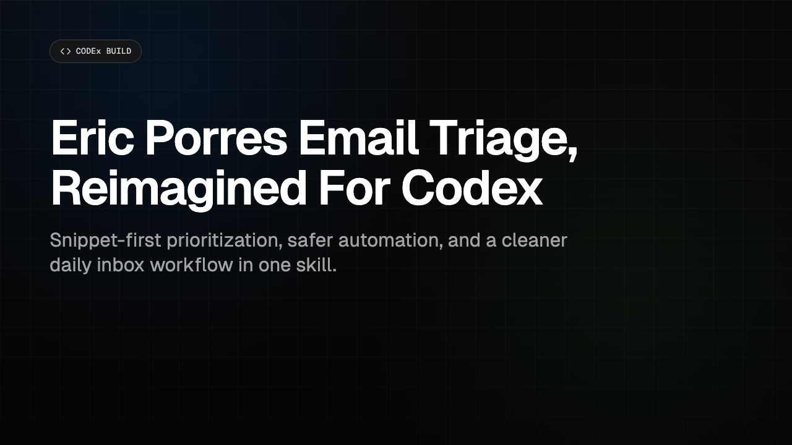

# Eric Porres Email Triage Skill for Codex

A production-grade Codex skill that turns Gmail into a clear action queue:

- `Reply Needed` for items that require action
- `Review` for items worth reading
- `Noise` for low-value bulk mail that can be archived safely

This repository is intended as both a real operational skill and a portfolio-quality engineering artifact.

## Teaser

[](assets/video/codex-teaser-low.mp4)

- Low-res teaser (mp4): `assets/video/codex-teaser-low.mp4`
- High-res teaser (mp4): `assets/video/codex-teaser.mp4`
- Poster frame (png): `assets/video/codex-teaser-poster.png`

## Why This Project

Most inbox tooling optimizes for filtering mechanics. This workflow optimizes for decision quality:

- time-windowed scanning instead of unread-state heuristics
- snippet-first triage for speed and token discipline
- thread-aware drafting for urgent messages
- explicit confirmation gates before any send/archive action

## Core Capabilities

- Gmail triage through MCP tools
- Deterministic three-tier classification
- Draft generation for Tier 1 items
- Explicit skill invocation (`$email-triage`) with implicit invocation disabled
- Release-grade evaluation and safety gates

## Installation

Codex discovers skills from `.agents/skills`.

Global install (user-scoped):

```bash
mkdir -p ~/.agents/skills
cp -R .agents/skills/email-triage ~/.agents/skills/email-triage
```

Repo-scoped usage:

- This repository already contains `.agents/skills/email-triage`.
- Run Codex in this repo to use the local skill.

Restart Codex after installation.

## Gmail MCP Setup

This skill requires a configured Gmail MCP server with search, read, thread, draft/send, and archive capabilities.

Template setup:

```bash
codex mcp add gmail --url https://<your-gmail-mcp-server>/mcp
codex mcp login gmail
```

Setup and troubleshooting guide:
- `.agents/skills/email-triage/references/setup-gmail-mcp.md`

## Usage

Because implicit invocation is disabled, invoke explicitly:

- "Use $email-triage to check email"
- "Use $email-triage to triage my inbox"
- "Use $email-triage for morning email"
- "Use $email-triage and draft a reply to #2"
- "Use $email-triage and archive noise"

## Output Contract

The skill returns:

- `# Inbox Triage - <YYYY-MM-DD>`
- `## Reply Needed (N)` with numbered entries
- `## Review (N)`
- `## Noise (N)` with category counts

Contract definition:
- `.agents/skills/email-triage/references/output-contract.md`

## Safety Model

- Never send without explicit confirmation
- Never archive without explicit confirmation
- Never permanently delete
- Never auto-execute destructive inbox actions

## Evaluation and Release Gates

Run the full validation suite:

```bash
bash scripts/run_all_checks.sh
```

What this verifies:

1. Fixture-based classification parity
2. Output-contract compliance
3. Required files and trigger markers
4. Markdown link integrity
5. `openai.yaml` structure and parse validity
6. Release validators, smoke checks, and unit tests

Manual live verification checklist:
- `tests/smoke/live-gmail-checklist.md`

## Provenance

This is an independent Codex adaptation of:

- Original project: [ericporres/email-triage-plugin](https://github.com/ericporres/email-triage-plugin)
- Original author: [Eric Porres](https://github.com/ericporres)

## Repository Layout

```text
eric-porres-email-triage-skill-codex/
├── README.md
├── LICENSE
├── NOTICE.md
├── .agents/skills/email-triage/    # Skill instructions and manifest
├── scripts/                        # Validation and release tooling
├── eval/                           # Fixture schema and evaluation docs
├── docs/release/                   # Go/no-go checklist and canary runbook
├── tests/                          # Deterministic checks and release tests
└── assets/video/                   # Teaser assets
```

## License

MIT. See `LICENSE` and `NOTICE.md`.
